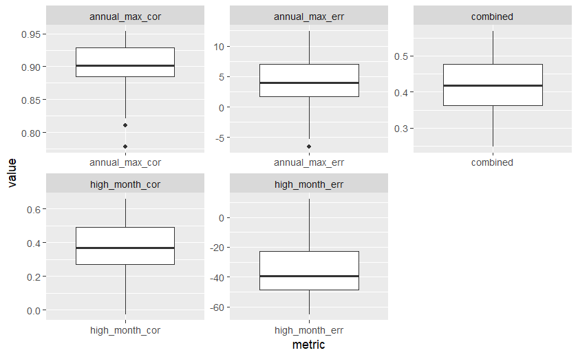
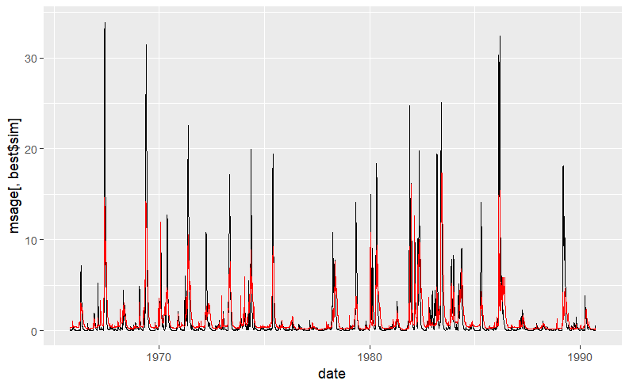
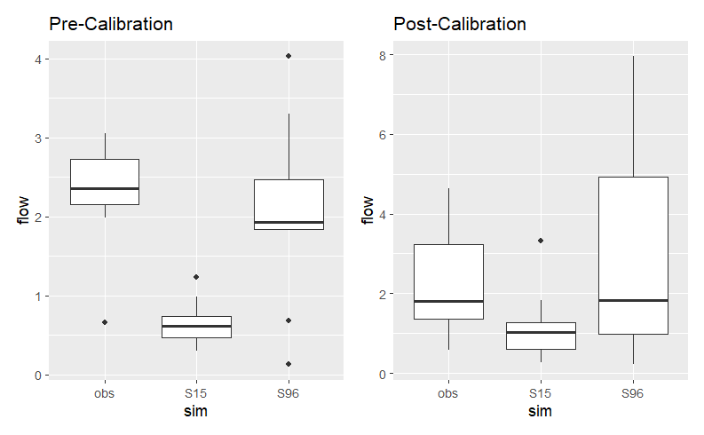

```{r, setup, include = FALSE}
knitr::opts_chunk$set(echo = TRUE, message = FALSE, warning = FALSE)

library(sensitivity)
library(tidyverse)
library(purrr)
library(ggpubr)
library(here)
library(kableExtra)
```

```{r, read in data}

#--------------------------
#   set working directory
#--------------------------
setwd(here::here())


#--------------------------
#   read in data
#--------------------------
#reading in observed stream flow data
sager = read.table(here("data","sager.txt"), header=T)

#simulated data from multiple model runs
# multiple results - assuming we've run the model for multiple years, each column
# is streamflow for a different parameter set
msage = read.table(here("data","sagerm.txt"), header=T)


#--------------------------
#   preprocessing data
#--------------------------

# add date ton sager
sager = sager %>%
  mutate(date = paste(day,month,year, sep="/"))

#converting to datetime format
sager$date = as.Date(sager$date,"%d/%m/%Y")

# "model" and "obs" columns are combined into a single column, and their corresponding values are placed in another column. 
sagerl = sager %>% pivot_longer(cols=c("model","obs"), names_to="source",
                                  values_to="flow")


```

## Assignment Instructions

Part 1: Come up with a combined metric that you think is interesting

-   if you can, try to include at least one metric (as part of your combined metric) that needs to be transformed
-   be creative - you can subset, aggregate, focus only on particular type of years or days
-   think about ecological or human water uses that depend on certain flow conditions

Part II

-   Perform a split-sample calibration on the Sagehen model output (sagerm.txt)
    -   you can decide what years to pick for pre and post calibration
    -   use your performance metric from Part I
-   Find the best and worst parameter set, given your performance metric
-   Graph something about streamflow (e.g daily, mean August, or ?) for the best parameter set
-   Compute and plot how the performance of the model using the best parameter set changed in pre and post calibration periods (that you chose)
-   Add the 'best' parameter set column number number to the quiz linked below (so we can compare how different metrics influence which parameter you pick)
-   Write 2-3 sentences to explain your metric design and comment on model performance based on your metric

Use to Best Parameter (Column) to record your 'best' parameter sets ([GO TO CANVAS FOR THIS TEST](https://ucsb.instructure.com/courses/19594/assignments/240440))

Hand in Rmarkdown and R file with your performance metric

# creating our model metric

For our assignment, we want to observe the time series of **high flow periods** and **peak flow periods** within the Sagehen Creek at Berkley. As noted in the graph below, we observed that during the year 1977, peak values of high water periods was during the month of April and May. This date will likely have flow rate high as spring time means rain. we could see higher levels of flooding within housing zones near the creek, which would be good to investigate.

```{r, model observations}
ggplot(subset(sagerl, wy==1977), aes(date, flow, col=source,
linetype=source))+
  geom_line()+
  scale_y_continuous(trans="log")+
  labs(y="streamflow
mm/day")
```

We also observe that there is a big dip from 1975 to 1977, which could be useful information later on.

After figuring out which time range we want to explore, we plot between our model and observations for variuos reasons: - look for differences in performance in different periods - does model capture seasonality, temporal trends - look for bias (error) (using a 1 to 1 line are points always above or below) - look for errors associated with particular magnitdues (e.g high or low values)

```{r}
# basic plot
ggplot(sagerl, aes(date, flow, col=source, linetype=source))+
  geom_line()

# change axis to get a closer look at performance at low values
# if we have high dynamic range (lots of large and small values), taking log can help
# with visualization
ggplot(sagerl, aes(date, flow, col=source, linetype=source))+
  geom_line()+
  scale_y_continuous(trans="log")+
  labs(y="streamflow mm/day")

# look at it another way
ggplot(sager, aes(obs, model))+
  geom_point()+
  geom_abline(intercept=0, slope=1, col="red")

```

we definitely see some correlation between our observation and model, meaning that we should be able to proceed with our model evaluation.

Because we want to evaluate the performance of the model based on high stream flow conditions in April, we will use three metrics to check this out:

-   `NSE.R` (Nash-Sutcliffe Efficiency)

-   `relerr.R`(Relative Error)

-   `cper.R` (relative error between model and obs)

```{r}
#--------------------------
#   sourcing in R scripts
#--------------------------

#Nash-Sutcliffe Efficiency
source("R/nse.R")

#relative error between the model and observations
source("R/relerr.R")

#combined performance metric between NSE and relative error
source("R/cper.R")


#calculates performance metrics focusing on high flow periods
# computes the error and correlation of annual max flows and monthly flows during 
# April(high flow months)
source("R/compute_highflowmetrics.R")

#computes a combined metric giving different weights to each metrics
source("R/compute_highflowmetrics_all.R")
```

And now we can compare model performance against our values:

```{r}

#using the functions we called earlier:
nse_value <- nse(m = sager$model, o = sager$obs)
relerr_value <- relerr(m = sager$model, o = sager$obs) * 100
cper_value <- cper(m = sager$model, o = sager$obs, weight.nse = 0.8)

# Create a data frame with the metric names and values
metrics_df <- data.frame(
  Metric = c("Nash-Sutcliffe Efficiency (NSE)", "Relative Error (%)", "Combined Performance (CP)"),
  Value = c(nse_value, relerr_value, cper_value)
)

# Use kable to create the table
kable(metrics_df, align = "c", caption = "Model Performance Metrics")
```

# Scale and subsetting

We are evaluating based on monthly time series, and looking specifically on April.

As we focus on this

```{r}
#-------------------
#High Flow Metric
##------------------
#we previously sourced our code from above:
# source("R/compute_highflowmetrics.R")

compute_highflowmetrics(m=sager$model,o=sager$obs, month=sager$month, day=sager$day, year=sager$year, wy=sager$wy)

# use different high flow months
table <- compute_highflowmetrics(m=sager$model,o=sager$obs, month=sager$month, day=sager$day, year=sager$year, wy=sager$wy, high_flow_months = c(4:5)) # using 4-5, which represents april and may

#converting into a data frame to display as a table in html
high_flow_table <- data.frame(table)
kable(high_flow_table)

```

# Create a combined metric

we want to summarize everything in one number

```{r}
perf_high = compute_highflowmetrics(m=sager$model,o=sager$obs, month=sager$month, day=sager$day, year=sager$year, wy=sager$wy, high_flow_months = c(4:5))

perf_high = as.data.frame((perf_high))
# remember you want error to be low but correlation to be high 
# so we need to transform in some way

# normalize by max error = if error is greater than this we don't care
# many ideas -  maybe 50% of mean daily summer observed low flow
tmp = sager %>% subset(month %in% c(4:5)) 
errmax_high = mean(tmp$obs)*0.5

perf_high = perf_high %>% mutate(annual_max_err_trans = max(0,(1-abs(annual_max_err/errmax_high) )))
      
# for monthly we can do a simpler thing to find maximum allowable errror   
tmp_high = sager %>% subset(month %in% c(3:5)) %>% group_by(wy, month) %>% summarize(obs=sum(obs))

errmax_high = mean(tmp_high$obs)*0.5
 
perf_high = perf_high %>% mutate(high_month_err_trans = max(0,(1-abs(high_month_err/errmax_high) )))

# now we have 4 measures that we can combine together

perf_high = perf_high %>% mutate(combined = (annual_max_cor + annual_max_err_trans + high_month_err_trans + high_month_cor)/4)
perf_high


# or weight differently 

perf_high = perf_high %>% mutate(combined2 = 0.1*annual_max_cor + 0.1*annual_max_err_trans + 0.4*high_month_err_trans+ 0.4*high_month_cor)

perf_high

```

```{r}
# multiple results - lets say we've run the model for multiple years, each column
# is streamflow for a different parameter set
#msage = read.table("data/sagerm.txt", header=T)  # read this in earlier

# lets say we know the start date from our earlier output
msage$date = sager$date
msage$month = sager$month
msage$year = sager$year
msage$day = sager$day
msage$wy = sager$wy

# and we still have observed data from above


# how can we plot all results - lets plot water year 1970 otherwise its hard to see
msagel = msage %>% pivot_longer(cols=!c(date, month, year, day,wy), names_to="run", values_to="flow")


#----------------- plot -----------------------
p1=ggplot(subset(msagel, wy == 1970), aes(as.Date(date), flow, col=run))+
  geom_line()+
  theme(legend.position = "none")

# lets add observed streamflow
p1+geom_line(data=subset(sager, wy == 1970), aes(as.Date(date), obs), size=2, col="black", linetype=2)+labs(y="Streamflow", x="Date")

#---------- measure performance -------------
# compute performance measures for all output
res = msage %>% select(!c("date","month","year","day","wy")) %>%
      map_dbl(nse, o=sager$obs )

```

Here we can see the simulated streamflow from the time span we originally chose. We expect to see these results for April, as we noted previously that there was a high water intake during the months of April and m=May. Therefor streamflow would be much faster. our dashed line represents our observed values, which seems to follow closely with our sumulated streamflow

## checking metrics

...not just by month, but by other factors too.

```{r}


source("R/compute_highflowmetrics_all.R")
res = msage %>% select(-date, -month, -day, -year, -wy ) %>%
  map_df(compute_highflowmetrics_all,  # using purr to 
         o=sager$obs,
         month=msage$month,
         day=msage$day,
         year=msage$year,
         wy=msage$wy)


# interesting to look at range of metrics - could use this to decide on
# acceptable values
summary(res)


# graph range of performance measures
resl = res %>% pivot_longer(cols=everything(), names_to="metric", values_to="value")
ggplot(resl, aes(metric, value))+geom_boxplot()+facet_wrap(~metric, scales="free")


# assign an identifier to each row, use the same identify for columns of original streamflow data
# we can then use that to pick data
res$run = seq(from=1,to=nrow(res))

colnames(msage)=c(res$run, "date","month","year","day","wy")

# best & worst one
best = res[which.max(res$combined),]
worst = res[which.min(res$combined),]

msagel  =  msage %>% pivot_longer(cols=!c(date, month, year, day,wy), names_to="run", values_to="flow")

ggplot(subset(msagel, run == best$run), aes(date, flow)) + 
  geom_line() +
  labs(x = "Date",
       y = "Flow (mm/month)",
       title = "Monthly Aggregate Maximum Stream Flow for best model run") +
  theme_linedraw()
```

# split sample calibration

now we begin our steps, in which we preprocess first, before subsetting and evaluating:

```{r process split,  eval=FALSE}
msage = read.table("data/sagerm.txt", header=T)
#
#
#
#
#------------------------
#   preprocessing
# ----------------------
# 
# CREATING OUR SIMULATION
# keep track of number of simulations (e.g results for each parameter set)
# use as a column names
nsim = ncol(msage)
snames = sprintf("S%d",seq(from=1, to=nsim))
colnames(msage)=snames


# ADDING DATE FROM SAGER TO MSAGE
msage$date = sager$date
msage$month = sager$month
msage$year = sager$year
msage$day = sager$day
msage$wy = sager$wy


# ADDING OBSERVED AND DATES OF STREAMFLOW USING LEFT JOIN FROM SAGER
msage = left_join(msage, sager[,c("obs","date")], by=c("date"))
head(msage)


#-----------------------
#   SUBSETTING
#----------------------

# CALLING IN METRICS
source("R/nse.R")
source("R/relerr.R")


#SUBSET FOR FOR WHEN WATER YEAR IS LESS THAN 1975
short_msage = subset(msage, wy < 1975) #this will be used for calibration

#-----------------------
#   COMPUTING METRICS 
#-----------------------


# compute performance measures for output from all parameters
res = short_msage %>% select(!c("date","month","year","day","wy","obs")) %>%
map_dbl(nse, short_msage$obs)  # using purr to run through each row using our metrics nse
# 
# acompute performance measures for output using our own combined metric
source("R/compute_highflowmetrics_all.R")
res = short_msage %>% select(-date, -month, -day, -year, -wy, -obs ) %>%
map_df(compute_highflowmetrics_all, o=short_msage$obs, month=short_msage$month,
day=short_msage$day, year=short_msage$year, wy=short_msage$wy)


#------------------------
#   POST-PROCESSING 
# AND DATA EXPLORATION
#------------------------
#
# we can add a row that links with simulation number
res$sim = snames

# graph range of performance measures
resl = res %>% pivot_longer(-sim, names_to="metric", values_to="value")
ggplot(resl, aes(metric, value))+geom_boxplot()+facet_wrap(~metric, scales="free")

```



# Selecting best and worst performing metrics

```{R, best and worst, eval = FALSE}
#-----------------------
#   SELECT BEST AND WORST 
#-----------------------


#-------------- best -----------------
# select the best one based on the combined metric
best = res[which.max(res$combined),]

# running the model forward
# so we can look at the full time series
# starting with streamflow estimates from best performing parameter set
# PLOT
ggplot(msage, aes(date, msage[,best$sim])) + 
  geom_line()+
  geom_line(aes(date, obs), col="red")

# ---------- worst -------------------
# for comparison, plotting how worst and best parameters perform for subsequent simulations
# focusing specifically on April streamflow
worst = res[which.min(res$combined),]

compruns = msage %>% 
  select(best$sim, worst$sim, date, obs, month, day, year, wy)


#---------------------
#   evaluating
#   performance
# -------------------

## post calibration
compruns_post = subset(compruns, wy > 1975)
compruns_mwy_post = compruns_post %>% 
  select(-c(day,date, year)) %>% 
  group_by(month, wy) %>%
  summarize(across(everything(), mean))

compruns_mwy_post = compruns_mwy_post %>% 
  pivot_longer(cols=!c(month,wy), names_to="sim", values_to="flow")

post <- compruns_mwy_post %>%
  subset(month==4) %>%
  ggplot(aes(sim,flow ))+
  geom_boxplot() +
  labs(title = "Post-Calibration")

## pre calibration
compruns_pre = subset(compruns, wy < 1975)
compruns_mwy_pre = compruns_pre %>% 
  select(-c(day,date, year)) %>%
  group_by(month, wy) %>%
  summarize(across(everything(), mean))


compruns_mwy_pre = compruns_mwy_pre %>%
  pivot_longer(cols=!c(month,wy), names_to="sim",values_to="flow")

pre <- compruns_mwy_pre %>% 
  subset(month==4) %>% 
  ggplot(aes(sim,flow ))+
  geom_boxplot() + 
  labs(title = "Pre-Calibration")

pre + post
```





The first plot shows a time-series(x axis) from 1965 to the 1990s of the best simulated water flow(y axis) and comparing it to our actual observed (red line) on Sagehen Creek. we see that there is clearly some similarities between both, however with our simulated model performing slightly higher than expected.

as for our second graph, we see simulations from post and pre calibration. for our pre calibration, we can note that S96 performed relatuvely well, having similar distribution and similar median than s15. However post-calibration shows that S96 has an even closer median to the observations, and so does S15.

as for splitting, we chose to split before and after 1975, as we noticed earlier a big dip in obverations. We hope to better explain why that is in class.
